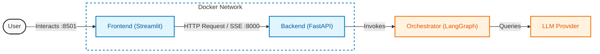

# AI Troubleshooting Agent

The **AI Troubleshooting Agent** is a microservices-based application designed to assist with network troubleshooting (specifically Cisco ACI) using an LLM-powered agentic workflow.

## Overview

The system consists of three main components:
1.  **Frontend**: A Streamlit application that provides a chat interface for users to interact with the agent.
2.  **Backend**: A FastAPI service hosting the LangGraph orchestrator and agent logic.
3.  **LLM**: External Large Language Model providers (e.g., OpenAI, Gemini) that power the agent's reasoning.

## Quick Start

### Prerequisites
- Docker and Docker Compose installed.
- An OpenAI API Key (or other provider key) set in your environment.

### Running the Application

1.  **Clone the repository**:
    ```bash
    git clone <repository-url>
    cd agent_langchain_antigravity_ralph
    ```

2.  **Set up Environment**:
    Create a `.env` file in the `backend` directory or use the root `.env` if configured.
    ```bash
    OPENAI_API_KEY=sk-...
    ```

3.  **Start Services**:
    ```bash
    docker-compose up --build
    ```

4.  **Access the Application**:
    - **Frontend**: Open [http://localhost:8501](http://localhost:8501) in your browser.
    - **Backend API Docs**: Open [http://localhost:8000/docs](http://localhost:8000/docs).

## Architecture

### High-Level Data Flow



### Agentic Workflow

The backend uses **LangGraph** to orchestrate the agent's behavior.


