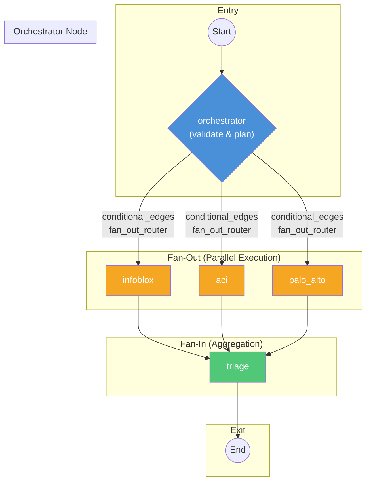

# Backend Service

The backend is a **FastAPI** microservice that runs the **LangGraph** orchestrator. It manages the agentic workflow, routes requests to sub-agents, and streams thoughts and responses back to the client.

## 🚀 Quick Start

Usually run via Docker Compose from the root, but for local development:

```bash
cd backend
python -m venv venv
source venv/bin/activate  # or venv\Scripts\activate on Windows
pip install -r requirements.txt

# Start the server
python -m uvicorn src.main:app --host 0.0.0.0 --port 8000 --reload
```

## 📡 API Reference

### 1. Chat (Streaming)
`POST /chat`

Initiates a chat with the orchestrator. This endpoint streams Server-Sent Events (SSE).

**Request Body:**
```json
{
  "message": "My internet is down",
  "model_name": "gemini-pro",     // Optional: Override default model
  "model_provider": "gemini"      // Optional: Override default provider
}
```

**Response (SSE Stream):**
The stream yields events of type `thought` or `routing`.

- **Event: `thought`**: Represents a step in the reasoning process or a final answer.
  ```json
  data: {
    "node": "orchestrator",
    "content": "I should check with the network specialist.",
    "type": "ai"
  }
  ```

- **Event: `routing`**: Indicates a transition in the graph.
  ```json
  data: {
    "routing": "network_specialist"
  }
  ```

- **Event: `triage_report`**: The final diagnosis report.
  ```json
  data: {
    "root_cause": "Firewall blocking traffic",
    "details": ["Allow rule missing for 10.0.0.1"],
    "action": "Add allow rule"
  }
  ```

### 2. Health Check
`GET /health`

Returns `{"status": "ok"}`. Used by Docker healthchecks.

### 3. Current Config
`GET /config`

Returns the currently loaded configuration (orchestrator model, active sub-agents).

## ⚙️ Configuration

Configuration is managed via `config.yaml` located in the `backend/` root (or `config.json`). It is loaded using Pydantic models for validation.

- **File**: `backend/config.yaml`
- **Loader**: `src.config.load_config`

### Structure
```yaml
orchestrator_model: "gpt-4-turbo"
orchestrator_provider: "openai"
system_prompt: "You are a helpful IT support orchestrator..."
sub_agents:
  - name: "network_specialist"
    description: "Expert in connectivity issues"
    tools: ["ping", "traceroute"]
```

### Environment Variables
Sensitive keys (like API keys) should be stored in a `.env` file in the `backend/` directory. The application loads this at startup using `python-dotenv`.

## 🏗️ Architecture (LangGraph)

The core logic resides in `src/orchestrator.py`. This module builds a LangGraph `StateGraph` that orchestrates parallel sub-agent execution.

### Graph Flow Diagram



### How the Orchestrator Adds Nodes and Edges

The graph is constructed in `build_graph()`:

#### 1. State Definition
```python
class AgentState(TypedDict):
    messages: Sequence[BaseMessage]          # Conversation history
    next_node: str                            # Next node to execute
    incident_data: Dict[str, Any]            # Shared incident context
    decision: OrchestratorDecision           # LLM routing decision
    sub_agent_results: Annotated[List[SubAgentResult], merge_sub_agent_results]  # Fan-in reducer
    triage_report: Optional[TriageReport]    # Final report
```

#### 2. Adding Nodes
Nodes are added using `workflow.add_node(name, callable)`:

```python
workflow = StateGraph(AgentState)

# Add the orchestrator (entry logic)
workflow.add_node("orchestrator", get_orchestrator_node(config))

# Add sub-agents (wrapped to return {"sub_agent_results": [...]} )
workflow.add_node("infoblox", wrap_sub_agent(get_infoblox_agent_node(config)))
workflow.add_node("aci", wrap_sub_agent(get_aci_agent_node(config)))
workflow.add_node("palo_alto", wrap_sub_agent(get_palo_alto_agent_node(config)))

# Add triage (aggregation)
workflow.add_node("triage", get_triage_node(config))
```

#### 3. Setting the Entry Point
```python
workflow.set_entry_point("orchestrator")
```

#### 4. Adding Conditional Edges (Fan-Out)
The orchestrator routes to sub-agents in parallel using `add_conditional_edges`:

```python
def fan_out_router(state: AgentState) -> List[str]:
    """Returns list of nodes to run in parallel based on decision.next_steps"""
    decision = state["decision"]
    nodes = []
    if "infoblox" in decision.next_steps:
        nodes.append("infoblox")
    if "aci" in decision.next_steps or "sub_agents" in decision.next_steps:
        nodes.append("aci")
    if "palo_alto" in decision.next_steps or "sub_agents" in decision.next_steps:
        nodes.append("palo_alto")
    return nodes if nodes else [END]

workflow.add_conditional_edges(
    "orchestrator",          # Source node
    fan_out_router,          # Router function
    ["infoblox", "aci", "palo_alto", END]  # Possible destinations
)
```

#### 5. Adding Static Edges (Fan-In)
All sub-agents converge to the triage node:

```python
workflow.add_edge("infoblox", "triage")
workflow.add_edge("aci", "triage")
workflow.add_edge("palo_alto", "triage")
workflow.add_edge("triage", END)
```

#### 6. Compilation
```python
return workflow.compile(checkpointer=checkpointer)
```

---

## 🔌 Extending the Backend

### Adding a New Sub-Agent

Follow these steps to add a new sub-agent to the orchestrator:

#### Step 1: Create the Agent Module

Create a new file in `src/sub_agents/` (e.g., `src/sub_agents/my_agent.py`):

```python
from langchain_core.tools import tool
from langgraph.prebuilt import create_react_agent
from ..config import AppConfig
from ..llm_factory import get_llm
from ..models import SubAgentResult, AgentStatus

# Define tools
@tool
def my_custom_tool(param: str) -> str:
    """Description of what this tool does."""
    return f"Tool executed with {param}"

def get_my_agent_node(config: AppConfig):
    """Factory function to create the agent node."""
    
    tools = [my_custom_tool]
    llm = get_llm(config.orchestrator_provider, config.orchestrator_model, temperature=0)
    agent = create_react_agent(llm, tools=tools)
    
    def my_agent_node(state) -> SubAgentResult:
        try:
            result = agent.invoke(state)
            last_msg = result["messages"][-1]
            summary = last_msg.content if hasattr(last_msg, "content") else str(last_msg)
            
            return SubAgentResult(
                agent_name="my_agent",
                raw_data={"messages": [m.content for m in result["messages"]]},
                summary=str(summary),
                status=AgentStatus.SUCCESS
            )
        except Exception as e:
            return SubAgentResult(
                agent_name="my_agent",
                raw_data={"error": str(e)},
                summary=f"Error: {str(e)}",
                status=AgentStatus.FAILURE
            )
    
    return my_agent_node
```

#### Step 2: Register in the Orchestrator

In `src/orchestrator.py`:

```python
# 1. Import your agent
from .sub_agents.my_agent import get_my_agent_node

# 2. Add the node (inside build_graph function)
my_agent_node = wrap_sub_agent(get_my_agent_node(config))
workflow.add_node("my_agent", my_agent_node)

# 3. Update fan_out_router to include your agent
if "my_agent" in decision.next_steps:
    nodes.append("my_agent")

# 4. Add conditional edge destination
workflow.add_conditional_edges(
    "orchestrator",
    fan_out_router,
    ["infoblox", "aci", "palo_alto", "my_agent", END]  # Add your agent here
)

# 5. Add fan-in edge to triage
workflow.add_edge("my_agent", "triage")
```

#### Step 3: Update Configuration (Optional)

Add to `config.yaml`:
```yaml
sub_agents:
  - name: "my_agent"
    description: "Description of what this agent does"
```

---

### Adding Dynamic Tools to an Agent

Dynamic tools are generated at runtime from JSON configuration. This is useful for API-driven tools where endpoints can be defined declaratively.

#### Step 1: Define the Tool Configuration

Create or update `config/aci_endpoints.json` (or a similar config file):

```json
[
    {
        "name": "get_device_status",
        "description": "Retrieves the status of a network device by ID.",
        "path": "/api/node/mo/{device_id}.json",
        "method": "GET",
        "parameters": [
            {
                "name": "device_id",
                "type": "str",
                "description": "The ID of the device to query."
            }
        ]
    }
]
```

**Configuration Schema:**
| Field | Type | Description |
|-------|------|-------------|
| `name` | string | Tool name (used by the LLM) |
| `description` | string | What the tool does (shown to LLM) |
| `path` | string | API endpoint path. Use `{param}` for interpolation |
| `method` | string | HTTP method: `GET`, `POST`, `PUT`, `DELETE` |
| `parameters` | array | List of parameter definitions |

**Parameter Schema:**
| Field | Type | Description |
|-------|------|-------------|
| `name` | string | Parameter name (must match `{placeholder}` in path) |
| `type` | string | Python type: `str`, `int`, `bool`, `float` |
| `description` | string | Parameter description for the LLM |

#### Step 2: Load and Create Tools

In your agent module (see `src/sub_agents/aci.py` for reference):

```python
from ..dynamic_tools import load_endpoints_config, create_dynamic_tool, ACIToolConfig

# Configure connection
tool_config = ACIToolConfig(
    base_url="https://api.example.com",
    username="user",
    password="pass",
    verify_ssl=False
)

# Load and create tools
tools = []  # Start with static tools
config_path = "config/my_endpoints.json"
if os.path.exists(config_path):
    endpoint_configs = load_endpoints_config(config_path)
    for ep_config in endpoint_configs:
        dynamic_tool = create_dynamic_tool(ep_config, tool_config=tool_config)
        tools.append(dynamic_tool)
```

#### How Dynamic Tools Work

The `dynamic_tools.py` module provides:

1. **`load_endpoints_config(path)`** - Loads JSON config into a list of dicts
2. **`create_dynamic_model(name, params)`** - Generates a Pydantic model for tool arguments
3. **`generic_aci_runner(path, method, tool_config, **kwargs)`** - Executes the HTTP call with path interpolation
4. **`create_dynamic_tool(config, tool_config)`** - Assembles everything into a `StructuredTool`

The flow:
```
JSON Config → create_dynamic_model() → Pydantic Args Schema
                                            ↓
                            create_dynamic_tool() → StructuredTool
                                            ↓
              generic_aci_runner() ← Tool invocation by LLM
```

---

### Adding a Static Tool

For simpler cases, define a tool directly using the `@tool` decorator:

```python
from langchain_core.tools import tool

@tool
def check_connectivity(target: str) -> str:
    """Check network connectivity to a target host."""
    # Your implementation here
    return f"Connectivity to {target}: OK"

# Add to your agent's tools list
tools = [check_connectivity, ...]
```
